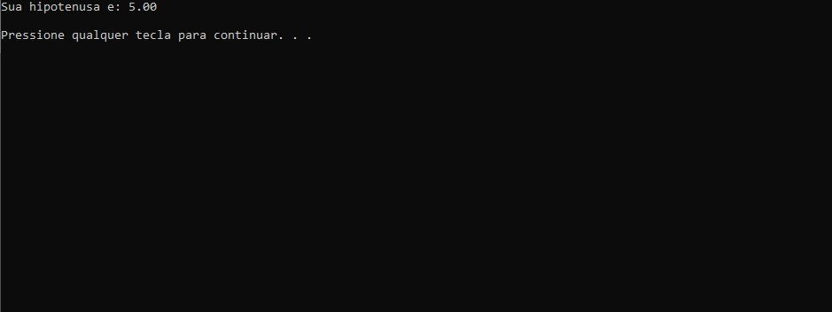

# HIPOTENUSA

<h2>ATIVIDADE</h2>

Atividade para o usuário colocar o dois catetos e o programa irá encontrar o valor da Hipotenusa.

<h2>Tecnologias</h2>

- C 

- GIT e GitHub 

<h2>Contato</h2>

viktorariel777@gmail.com

